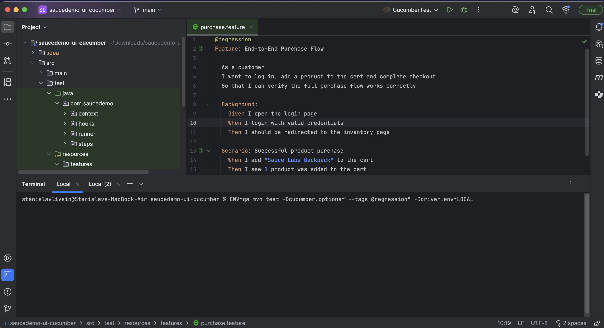
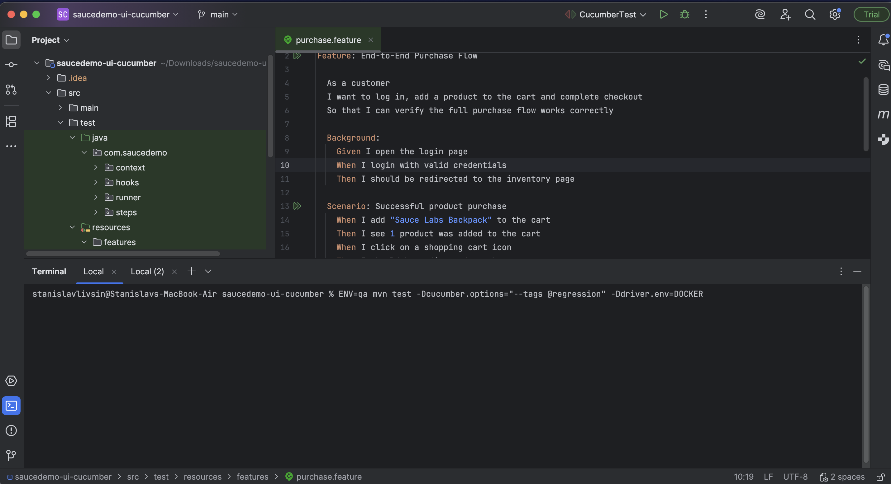
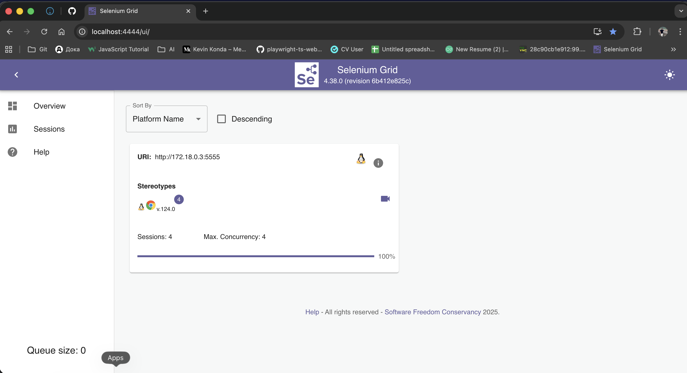
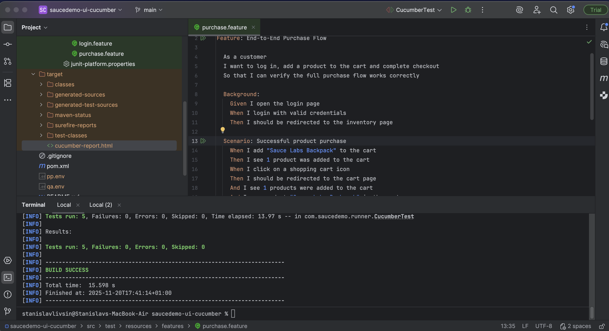
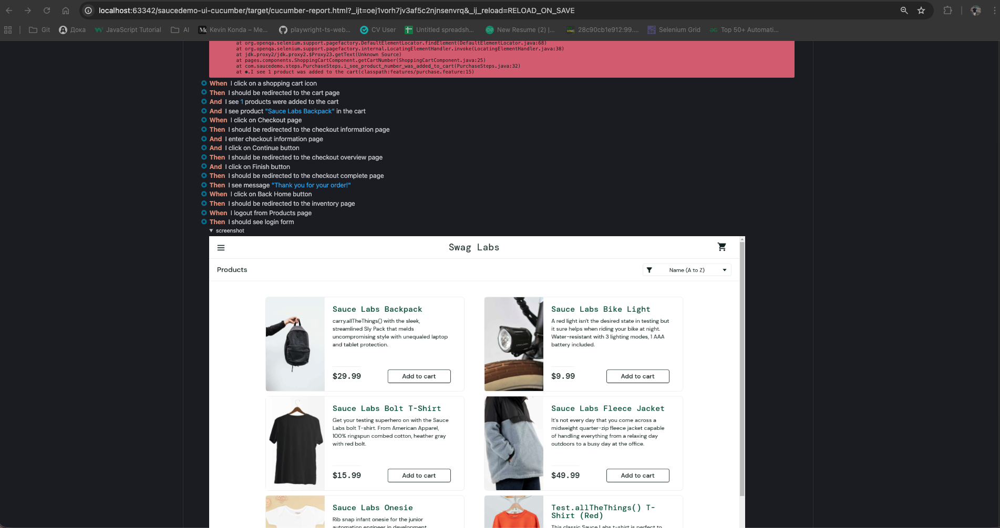

# 🧪 SauceDemo UI Automation Framework  
Automated UI testing framework for **SauceDemo** using:

- **Java 21**
- **Selenium WebDriver**
- **Cucumber (BDD)**
- **JUnit 5**
- **Page Object Model (POM)**
- **WebDriverManager**
- **Maven**

## 🚀 Tech Stack

| Layer                   | Technology         |
|-------------------------|--------------------|
| Test Runner             | JUnit 5 + Cucumber |
| UI Automation           | Selenium WebDriver |
| Design Pattern          | Page Object Model  |
| Build Tool              | Maven              |
| Driver Management       | WebDriverManager   |
| Language                | **Java 21**        |

## ▶️ Running Tests

To run tests against the QA environment, create a file:

```.env.qa```

Сontent:

```
BASE_URL=https://saucedemo.com/
USERNAME=standard_user
BLOCKED_USERNAME=locked_out_user
PASSWORD=secret_sauce
```

## 🖥️ Running Tests Locally

```ENV=qa mvn test -Dcucumber.options="--tags @regression" -Ddriver.env=LOCAL```



## 🐳 Running Tests in Docker (Selenium Grid)

```ENV=qa mvn test -Dcucumber.options="--tags @regression" -Ddriver.env=DOCKER```




## 📄 Test Reports

After running the tests, an HTML report is generated at:

```target/cucumber-report.html```


### Success tests ✅


### Failed tests ❌ 

